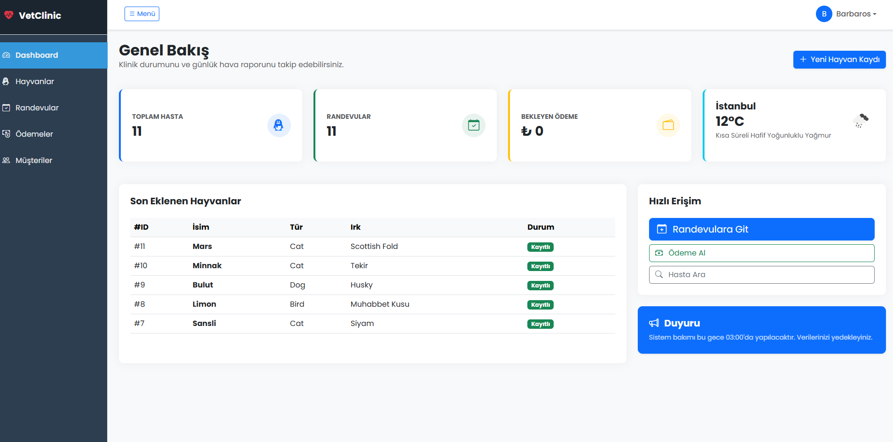
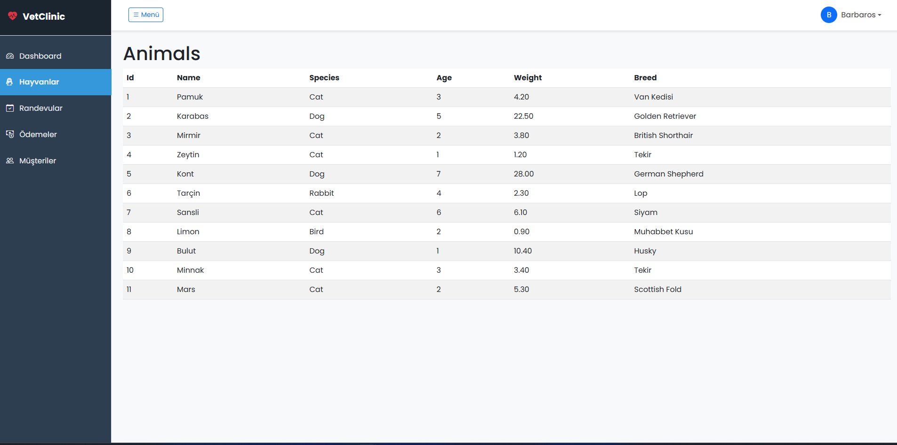
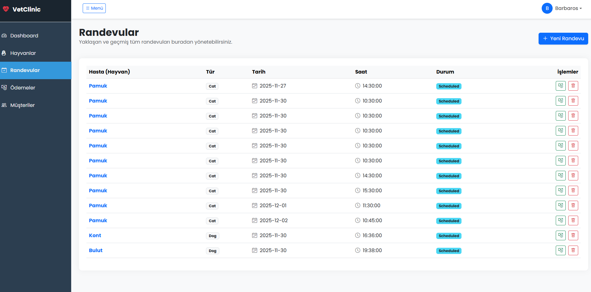
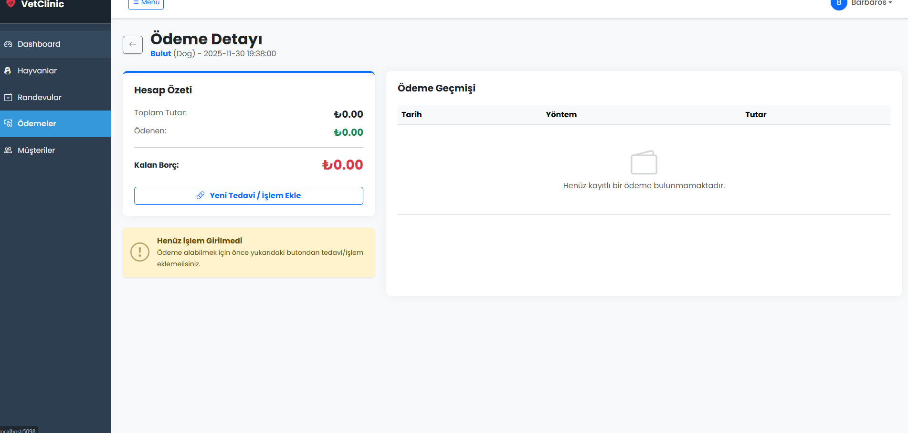
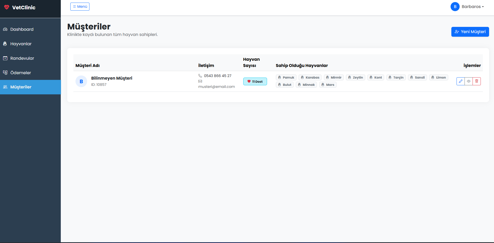

# VeterinaryClinicSystem

EN: A realistic Veterinary Clinic Management System built with .NET 10, layered architecture, JWT auth, RabbitMQ messaging and a modern ASP.NET Core MVC UI.  
TR: .NET 10, katmanlı mimari, JWT kimlik doğrulama, RabbitMQ mesajlaşma ve modern ASP.NET Core MVC arayüzü ile geliştirilmiş gerçekçi bir Veteriner Klinik Yönetim Sistemi.

Geliştirme amacı:

EN: Full-stack learning & portfolio project that follows real-world patterns.  
TR: Gerçek hayata yakın mimarilerle hazırlanmış bir full-stack öğrenme ve portföy projesi.

---

## Contents / İçindekiler

1. Overview / Genel Bakış  
2. Architecture / Mimari  
3. Solution Structure / Çözüm Yapısı  
4. Features / Özellikler  
5. Tech Stack / Teknolojiler  
6. Getting Started / Başlangıç  
7. Auth Flow / Kimlik Doğrulama Akışı  
8. Roadmap / Yol Haritası  
9. Author / Yazar  

---

## 1. Overview / Genel Bakış

EN:

VeterinaryClinicSystem is a small but realistic clinic management application:

- Manage animals, owners, appointments, treatments and payments  
- ASP.NET Core Web API secured with JWT  
- ASP.NET Core MVC UI with cookie authentication and a modern Bootstrap dashboard  
- RabbitMQ messaging for domain events (e.g. `PaymentCreated`)  
- External Weather API integration for contextual information on the dashboard  

TR:

VeterinaryClinicSystem küçük ama gerçekçi bir klinik yönetim uygulamasıdır:

- Hayvan, sahip, randevu, tedavi ve ödeme yönetimi  
- JWT ile korunan ASP.NET Core Web API  
- Cookie authentication kullanan modern Bootstrap tabanlı ASP.NET Core MVC arayüzü  
- Alan olayları için RabbitMQ mesajlaşma (ör. `PaymentCreated`)  
- Dashboard üzerinde bağlamsal bilgi için harici Weather API entegrasyonu  

---

## 2. Architecture / Mimari

EN:

The project follows a classic layered architecture with clear separation of concerns:

- **Entities** → domain models and enums  
- **DataAccess** → EF Core DbContext, repositories, Unit of Work  
- **Business** → application services, domain logic  
- **API** → ASP.NET Core Web API, JWT auth, Swagger  
- **UI** → ASP.NET Core MVC, cookie auth, typed HttpClient  
- **Messaging** → RabbitMQ integration for publishing domain events  
- **Worker** → background consumer (RabbitMQ) for reporting / async work  

TR:

Proje, sorumlulukların net ayrıldığı klasik katmanlı mimariyi takip eder:

- **Entities** → domain modelleri ve enum’lar  
- **DataAccess** → EF Core DbContext, repository’ler, Unit of Work  
- **Business** → uygulama servisleri, iş kuralları  
- **API** → ASP.NET Core Web API, JWT kimlik doğrulama, Swagger  
- **UI** → ASP.NET Core MVC, cookie auth, tip güvenli HttpClient  
- **Messaging** → alan olayları için RabbitMQ entegrasyonu  
- **Worker** → raporlama / asenkron işler için RabbitMQ tüketicisi  

### Layers / Katmanlar

**Entities**

- Domain classes: `User`, `Animal`, `Appointment`, `Treatment`, `Payment`, `WeatherInfo`  
- Base entity: `BaseEntity` (`Id`, `CreatedAt`, `UpdatedAt`, `IsDeleted`)  
- Enums:
  - `UserRole` (e.g. Manager, Customer)  
  - `AppointmentStatus`  
  - `PaymentMethod`  
  - `TreatmentType`  

**DataAccess**

- `VeterinaryClinicDbContext` (EF Core, SQL Server)  
- Generic repository:
  - `IGenericRepository<T>` / `GenericRepository<T>`  
- Unit of Work:
  - `IUnitOfWork` / `UnitOfWork`  

**Business**

- Services:
  - `IAnimalService` / `AnimalService`  
  - `IAppointmentService` / `AppointmentService`  
  - `ITreatmentService` / `TreatmentService`  
  - `IPaymentService` / `PaymentService`  
- Responsibilities:
  - Validation and domain rules  
  - Appointment lifecycle  
  - Treatment records and totals  
  - Per-appointment payment summary and balance calculation  

**API**

- ASP.NET Core Web API project: `VeterinaryClinic.API`  
- Controllers (typical examples):
  - `AnimalsController` – CRUD for animals  
  - `AppointmentsController` – scheduling, listing, details  
  - `TreatmentsController` – add / list treatments per appointment  
  - `PaymentsController` – list & summary per appointment, create payment  
  - `AuthController` – register & login, returns JWT token  
  - `WeatherController` – wraps external Weather API  
- Cross-cutting:
  - JWT auth (`JwtSettings` in `appsettings.json`)  
  - Swagger / OpenAPI configuration  
  - RabbitMQ publisher: `RabbitMqMessagePublisher`  

**UI**

- ASP.NET Core MVC project: `VeterinaryClinic.UI`  
- Authentication:
  - Cookie-based sign-in  
  - `AccountController` calls API `/api/Auth/login`, stores JWT in claims  
  - `AuthenticatedHttpClientHandler` attaches `Authorization: Bearer <token>` header  
- Typed HttpClients:
  - `IAnimalApiClient` / `AnimalApiClient`  
  - `IAppointmentApiClient` / `AppointmentApiClient`  
  - `IPaymentApiClient` / `PaymentApiClient`  
  - `IAuthApiClient` / `AuthApiClient`  
- UI Pages / Controllers:
  - `Home` – dashboard, quick stats, weather info  
  - `Animals` – animal list / details / CRUD  
  - `Appointments` – appointment planning and details  
  - `Treatments` – treatments per appointment  
  - `Payments` – payment summary + payment history  
  - `Customers` – placeholder for owner management  
- Styling:
  - Bootstrap 5, Bootstrap Icons, custom layout with sidebar “VetClinic” dashboard  

**Messaging**

- Project: `VeterinaryClinic.Messaging` (options & interfaces)  
- Options:
  - `RabbitMqOptions` bound from configuration (`RabbitMQ` section)  
- Publisher:
  - `IMessagePublisher` interface  
  - `RabbitMqMessagePublisher` implementation (API side)  
  - Used after successful `Payment` creation to publish `PaymentCreated` events  

**Worker**

- Project: `VeterinaryClinic.Worker` (background service)  
- Listens to RabbitMQ queue(s), e.g. `payment-events`  
- Can be extended to:
  - Build reporting read-models  
  - Send notifications  
  - Integrate with external systems  

---

## 3. Solution Structure / Çözüm Yapısı

Approximate structure / Yaklaşık klasör yapısı:

```text
VeterinaryClinicSystem.sln
├── VeterinaryClinic.Entities
├── VeterinaryClinic.DataAccess
├── VeterinaryClinic.Business
├── VeterinaryClinic.API
├── VeterinaryClinic.UI
├── VeterinaryClinic.Messaging
└── VeterinaryClinic.Worker
```

Each project has its own responsibility and references only what it needs.  
Her proje kendi sorumluluğuna sahiptir ve sadece ihtiyaç duyduğu katmanları referans alır.

---

## 4. Features / Özellikler

**EN:**

- Animal management (species, breed, medical history, owner relation)  
- Per-animal appointment history  
- Appointment creation with date, time, vet, notes  
- Treatment records (type, description, price)  
- Automatic calculation of total treatment cost per appointment  
- Payment management:
  - Per-appointment payment list  
  - Summary (total cost / total paid / remaining balance)  
  - Payment methods: Cash, CreditCard, BankTransfer, etc.  
- JWT-secured Web API  
- Cookie-authenticated MVC UI  
- RabbitMQ-based event publishing for payments  
- External Weather API shown on dashboard  

**TR:**

- Hayvan yönetimi (tür, ırk, tıbbi geçmiş, sahip ilişkisi)  
- Hayvan bazlı randevu geçmişi  
- Tarih, saat, veteriner ve notlarla randevu oluşturma  
- Tedavi kayıtları (tip, açıklama, fiyat)  
- Randevu bazında toplam tedavi ücretinin otomatik hesaplanması  
- Ödeme yönetimi:
  - Randevuya bağlı ödeme listesi  
  - Özet (toplam tutar / ödenen / kalan borç)  
  - Ödeme yöntemleri: Nakit, Kredi Kartı, Havale vb.  
- JWT ile korunan Web API  
- Cookie ile kimlik doğrulanan MVC arayüz  
- Ödemeler için RabbitMQ tabanlı event yayınlama  
- Dashboard üzerinde harici Weather API bilgisi  

---

## 5. Tech Stack / Teknolojiler

**Language / Dil**

- C# 14 / .NET 10

**Backend**

- ASP.NET Core Web API  
- Entity Framework Core (SQL Server)  
- JWT (JSON Web Token) authentication  
- Swashbuckle / Swagger for API documentation  

**Frontend**

- ASP.NET Core MVC  
- Razor Views, TagHelpers  
- Bootstrap 5, Bootstrap Icons  

**Messaging**

- RabbitMQ  

**Database**

- SQL Server / LocalDB  

**Others**

- HttpClient factory & typed clients  
- Options pattern (`IOptions<T>`)  
- Dependency Injection everywhere  

---

## 6. Getting Started / Başlangıç

### 6.1. Prerequisites / Önkoşullar

- .NET SDK 10 (veya projede kullandığın ilgili sürüm)  
- SQL Server veya LocalDB  
- RabbitMQ server (localhost varsayılan kurulumu yeterli)  

### 6.2. Clone the repository / Depoyu klonla

```bash
git clone https://github.com/barbarosalagoz/VeterinaryClinicSystem.git
cd VeterinaryClinicSystem
```
### 6.3. Configuration / Konfigürasyon

Create or update `appsettings.Development.json` files (especially under `VeterinaryClinic.API` and `VeterinaryClinic.UI`).  
`appsettings.Development.json` dosyalarını oluştur veya güncelle (özellikle `VeterinaryClinic.API` ve `VeterinaryClinic.UI` altında).

**Example API settings (VeterinaryClinic.API):**

```json
{
  "ConnectionStrings": {
    "DefaultConnection": "Server=.;Database=VeterinaryClinicDb;Trusted_Connection=True;TrustServerCertificate=True"
  },
  "JwtSettings": {
    "Issuer": "VetClinic",
    "Audience": "VetClinicClients",
    "SecretKey": "CHANGE_THIS_TO_A_LONG_SECURE_KEY",
    "AccessTokenExpirationMinutes": 60
  },
  "RabbitMQ": {
    "HostName": "localhost",
    "UserName": "guest",
    "Password": "guest",
    "Port": 5672,
    "VirtualHost": "/"
  },
  "WeatherApi": {
    "BaseUrl": "https://api.example.com",
    "ApiKey": "YOUR_WEATHER_API_KEY"
  }
}
```
> Port numbers may differ depending on your environment and launch profile.  
> Port numaraları, ortamına ve launch profiline göre değişebilir.

---

### 6.4. Database migration / Veritabanı

**If you have EF Core migrations / Eğer EF Core migration’ların varsa:**

```bash
cd VeterinaryClinic.API
dotnet ef database update
```
**Or use Package Manager Console in Visual Studio /  
Ya da Visual Studio Package Manager Console üzerinden:**

```ps
Update-Database
```
### 6.5. Run the projects / Projeleri çalıştır

- Start **VeterinaryClinic.API** (Swagger should open).  
- Start **VeterinaryClinic.UI** (MVC dashboard).  
- Optionally start **VeterinaryClinic.Worker** for RabbitMQ consumer.

---

## 7. Auth Flow / Kimlik Doğrulama Akışı

**EN:**

- User registers via `/api/Auth/register` (Swagger) or via a seeding script.  
- Login is handled in UI (`AccountController` → `IAuthApiClient.LoginAsync`).  
- API returns an `AuthResponse` containing:
  - `token` (JWT)  
  - `expiresAt`  
  - `fullName`, `email`, `role`  
- UI stores the token in cookie claims (`access_token` claim).  
- Typed HttpClients use `AuthenticatedHttpClientHandler` to attach:

  ```http
  Authorization: Bearer {token}
  ```

  - API controllers are decorated with `[Authorize]` (and optionally `[Authorize(Roles = "Manager")]`).

**TR:**

- Kullanıcı `/api/Auth/register` (Swagger) veya seed işlemiyle oluşturulur.
- Giriş, UI tarafında `AccountController` ve `IAuthApiClient.LoginAsync` ile yapılır.
- API, aşağıdaki alanlara sahip bir `AuthResponse` döner:
  - `token` (JWT)
  - `expiresAt`
  - `fullName`, `email`, `role`
- UI bu token’ı cookie claim’i olarak saklar (`access_token` claim’i).
- Tip güvenli HttpClient’ler `AuthenticatedHttpClientHandler` üzerinden:

  ```http
  Authorization: Bearer {token}
  ```

- API controller’ları `[Authorize]` (ve gerekirse `[Authorize(Roles = "Manager")]`) ile korunur.

---

## 8. Roadmap / Yol Haritası

**EN – Possible next steps:**

- Owner / customer management screens  
- Detailed animal medical history view  
- Role-based authorization in UI (Manager vs Customer view)  
- More complete reporting in Worker project  
- Docker-compose for SQL Server + RabbitMQ + API + UI  
- Localization in UI (full TR/EN toggle)  

**TR – Olası sonraki adımlar:**

- Müşteri / sahip yönetim ekranları  
- Detaylı hayvan tıbbi geçmiş ekranı  
- UI tarafında rol bazlı yetkilendirme (Yönetici / Müşteri)  
- Worker projesinde daha gelişmiş raporlama  
- SQL Server + RabbitMQ + API + UI için docker-compose  
- UI tarafında tam TR/EN çok dillilik  

---

## 9. Author / Yazar

**Barbaros Emre Alagöz**  
Full-stack developer in progress & MIS student.

GitHub: [@barbarosalagoz](https://github.com/barbarosalagoz)

EN: Feedback, issues and PRs are welcome.  
TR: Her türlü geri bildirim, issue ve PR’a açığım. 🙂

---

## 🖼 Screenshots / Ekran Görüntüleri

<table>
  <tr>
    <td align="center" width="50%">
      <strong>Login Page / Giriş Ekranı</strong><br />
      
    </td>
    <td align="center" width="50%">
      <strong>Dashboard</strong><br />
      
    </td>
  </tr>
  <tr>
    <td align="center" width="50%">
      <strong>Animals / Hayvanlar</strong><br />
      
    </td>
    <td align="center" width="50%">
      <strong>Appointments / Randevular</strong><br />
      
    </td>
  </tr>
  <tr>
    <td align="center" width="50%">
      <strong>Payment Detail / Ödeme Detayı</strong><br />
      
    </td>
    <td align="center" width="50%">
      <strong>Customers / Müşteriler</strong><br />
      
    </td>
  </tr>
</table>

---
